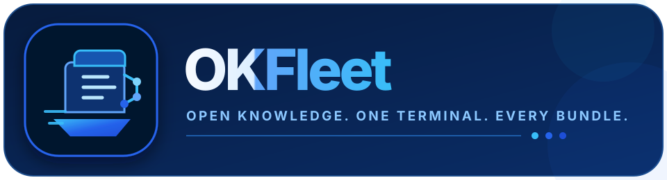
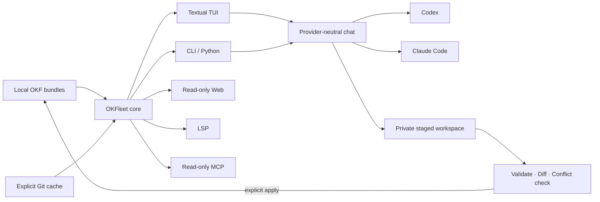

<p align="center">
  
</p>

<p align="center">
  <strong>The local-first developer workbench for Open Knowledge Format.</strong><br>
  Explore, search, validate, govern, and safely improve an entire fleet of knowledge bundles—with or without an AI agent.
</p>

<p align="center">
  <a href="https://github.com/kodepapa/okf-plugin/actions/workflows/ci.yml"></a>
  <a href="https://github.com/kodepapa/okf-plugin/actions/workflows/release-please.yml"></a>
  
  
  
  
</p>

<p align="center">
  <a href="#quickstart">Quickstart</a> ·
  <a href="#what-you-get">Features</a> ·
  <a href="#agent-workflows">Agent workflows</a> ·
  <a href="#architecture">Architecture</a> ·
  <a href="#documentation">Documentation</a> ·
  <a href="CONTRIBUTING.md">Contributing</a>
</p>

---

## Why OKFleet?

An OKF bundle is deliberately simple: Markdown documents with YAML frontmatter. That simplicity is its strength—but once knowledge spans multiple repositories, teams need discovery, retrieval, quality checks, safe authoring, and tooling that does not lock their knowledge into one agent or vendor.

OKFleet provides that missing workbench. The deterministic core works without an AI provider; Codex and Claude Code become optional collaborators on top of the same validated bundle model.

## What you get

<table>
  <tr>
    <td width="50%" valign="top">
      <h3>🧭 One knowledge navigator</h3>
      Discover local bundles, register global ones, create collections, browse concepts, follow backlinks, and inspect neighborhood graphs from a full-screen Textual TUI.
    </td>
    <td width="50%" valign="top">
      <h3>🔎 Fleet-wide retrieval</h3>
      Incremental SQLite FTS5 search, field filters, saved searches, named scopes, and opt-in dependency-free semantic retrieval across one bundle or the whole fleet.
    </td>
  </tr>
  <tr>
    <td width="50%" valign="top">
      <h3>🛡️ Knowledge quality</h3>
      Validate frontmatter, indexes, links, duplicate IDs, staleness, orphans, team policy packs, and extension diagnostics—with text, JSON, and SARIF output.
    </td>
    <td width="50%" valign="top">
      <h3>🤖 Safe agent collaboration</h3>
      Chat through Codex or Claude Code using existing CLI authentication. Fleet chat is read-only; work mode edits a private snapshot for review before apply.
    </td>
  </tr>
  <tr>
    <td width="50%" valign="top">
      <h3>🧰 Developer-native surfaces</h3>
      Use the TUI, composable CLI, Python library, read-only MCP server, local web explorer, or LSP diagnostics and Markdown-link navigation.
    </td>
    <td width="50%" valign="top">
      <h3>🔌 Open extension points</h3>
      Import OpenAPI, dbt, SQL, and catalogs; compare bundle drift; cache Git remotes; and add custom importers, templates, or diagnostics through Python entry points.
    </td>
  </tr>
</table>

## Quickstart

OKFleet currently targets Python 3.11+ and is installed from source while the package is in beta.

```bash
git clone https://github.com/kodepapa/okf-plugin.git
cd okf-plugin
uv sync --extra dev
uv run okfleet doctor
uv run okfleet
```

Running `okfleet` without a subcommand opens the TUI in the current directory.

```bash
# Find and register knowledge
okfleet discover ~/work
okfleet bundles add ~/work/knowledge/warehouse --alias warehouse
okfleet bundles refresh

# Search and inspect
okfleet search 'type:Metric revenue'
okfleet show warehouse:metrics/net_revenue
okfleet graph warehouse:metrics/net_revenue --format mermaid

# Validate and maintain
okfleet validate warehouse
okfleet health warehouse --stale-after 180
okfleet index warehouse --write
```

Once published, the intended zero-install entry point is `uvx okfleet`.

## Agent workflows

OKFleet exposes the same bundle context and safety model to both supported providers.

| Mode | Scope | Filesystem access | Intended use |
|---|---|---|---|
| `bundle` | One bundle | Read-only | Ask grounded questions about a bundle. |
| `fleet` | Registered bundles or a collection | Read-only, retrieved context only | Compare concepts across bundles. |
| `work` | One private snapshot | Staged writes | Improve knowledge, inspect the diff, then explicitly apply. |

```bash
okfleet chat 'How is net revenue defined?' --scope warehouse --provider codex
okfleet chat 'Compare revenue definitions across bundles' --scope fleet --provider claude
okfleet chat 'Improve the Orders documentation' --scope warehouse --mode work --provider codex
```

Work mode never targets the source bundle directly. It stages the result, validates it, checks source hashes for concurrent changes, and prints a reviewable diff. Add `--apply` only when a completed staged result should be written back.

## Everyday workflows

<details>
<summary><strong>Search, collections, and semantic retrieval</strong></summary>

```bash
okfleet collections create production warehouse analytics
okfleet search 'tag:finance type:Metric' --collection production
okfleet search 'customer lifetime value' --semantic
okfleet searches save finance-review 'tag:finance type:Metric' --bundle warehouse
okfleet searches run finance-review
```

</details>

<details>
<summary><strong>Create, move, import, and compare knowledge</strong></summary>

```bash
okfleet new warehouse metrics/gross-margin --type Metric --write
okfleet move warehouse:metrics/gross-margin metrics/gross_margin --write
okfleet import ./openapi.yaml warehouse --kind openapi             # preview
okfleet import ./manifest.json warehouse --kind dbt --write
okfleet compare warehouse warehouse-next --format json
```

</details>

<details>
<summary><strong>Remote bundles, web explorer, editor, and MCP</strong></summary>

```bash
okfleet bundles clone https://github.com/acme/knowledge.git --alias acme
okfleet bundles update acme
okfleet web --path ~/work
okfleet lsp
okfleet mcp serve
```

The web explorer binds to `127.0.0.1:8765` by default. It has no mutation endpoints or authentication, so non-loopback binding requires an explicit `--allow-remote`.

</details>

## TUI command map

| Key | Action | Key | Action |
|---|---|---|---|
| `/` | Search loaded bundles | `c` | Focus chat |
| `v` | Validation and health | `d` | Toggle staged diff |
| `Esc` | Cancel provider turn | `Ctrl+X` | Discard staged snapshot |
| `r` | Refresh and reindex | `Ctrl+P` | Command palette |
| `?` | Help | `q` | Quit |

## Architecture

Every interface delegates to one deterministic core. Agent providers do not own bundle parsing, validation, search, or apply semantics.



The registry and derived SQLite database live in platform-appropriate user directories. Bundle Markdown remains the source of truth.

## Agent Skills and plugins

| Skill | Purpose |
|---|---|
| [`okf-author`](skills/okf-author/SKILL.md) | Create, edit, enrich, cross-link, index, log, and validate bundles. |
| [`okf-read`](skills/okf-read/SKILL.md) | Navigate bundles progressively and answer source-grounded questions. |

Install the Claude Code plugin:

```text
/plugin marketplace add kodepapa/okf-plugin
/plugin install okf@okf-plugin
```

The repository also includes a Codex manifest at [`.codex-plugin/plugin.json`](.codex-plugin/plugin.json) and read-only MCP wiring in [`.mcp.json`](.mcp.json). The standalone helpers inside both skills remain self-contained and compatible with older Python installations.

## Privacy and safety

- Bundle files, registry state, staged snapshots, and the search database stay local.
- OKFleet does not read, copy, or store provider credentials.
- Fleet chat receives retrieved read-only context from an empty temporary directory.
- Bundle content is labelled as untrusted reference data in provider prompts.
- Work sessions edit a snapshot; apply uses complete-tree hashes to block stale overwrites.
- No command automatically commits, pushes, opens a pull request, or grants unrestricted shell access.

Read the full [security and privacy model](docs/SECURITY.md).

## Documentation

| Document | What it covers |
|---|---|
| [Development plan](docs/OKFLEET_DEVELOPMENT_PLAN.md) | Product scope, architecture, milestones, acceptance criteria, and agent-ready work breakdown. |
| [Advanced workflows](docs/EXTENDING_OKFLEET.md) | Importers, policies, remote caches, web, LSP, and Python extension contracts. |
| [Provider protocols](docs/PROVIDER_PROTOCOLS.md) | Codex app-server/exec and Claude Code stream-JSON behavior. |
| [OKF compatibility](docs/OKF_COMPATIBILITY.md) | Specification support and standalone-helper parity. |
| [Security](docs/SECURITY.md) | Trust boundaries, privacy, staging, and remote-access guidance. |
| [Contributing](CONTRIBUTING.md) | Local setup, tests, and contribution workflow. |
| [Releasing](docs/RELEASING.md) | Conventional commits, Release Please, tags, and GitHub releases. |
| [Changelog](CHANGELOG.md) | User-visible changes by release. |

## Configuration

| Variable | Purpose |
|---|---|
| `OKFLEET_CONFIG` | Registry and configuration TOML path. |
| `OKFLEET_DATABASE` | SQLite search and session database path. |
| `OKFLEET_CHANGESETS` | Persisted staged-work directory. |
| `OKFLEET_REMOTE_CACHE` | Cache directory for explicitly cloned remote bundles. |
| `OKFLEET_CODEX_PROTOCOL=exec` | Force the Codex JSONL fallback instead of app-server. |

## Development

```bash
uv sync --extra dev
uv run ruff check .
uv run ruff format --check .
uv run mypy src
uv run pytest
uv build
```

The test suite covers the core, CLI, provider protocols, staged writes, TUI, web service, LSP, importers, policies, and compatibility helpers. CI runs on macOS and Linux across Python 3.11–3.13.

## Contributing

Issues and pull requests are welcome. Start with [CONTRIBUTING.md](CONTRIBUTING.md), keep provider-independent behavior in the core, and include tests for user-visible changes. For security concerns, follow the private-reporting guidance in [docs/SECURITY.md](docs/SECURITY.md).

## License

A repository-wide license has not yet been declared. The vendored OKF v0.1 specification in `skills/okf-author/references/spec.md` retains its upstream Apache 2.0 license. Choose and add a project license before public distribution.
