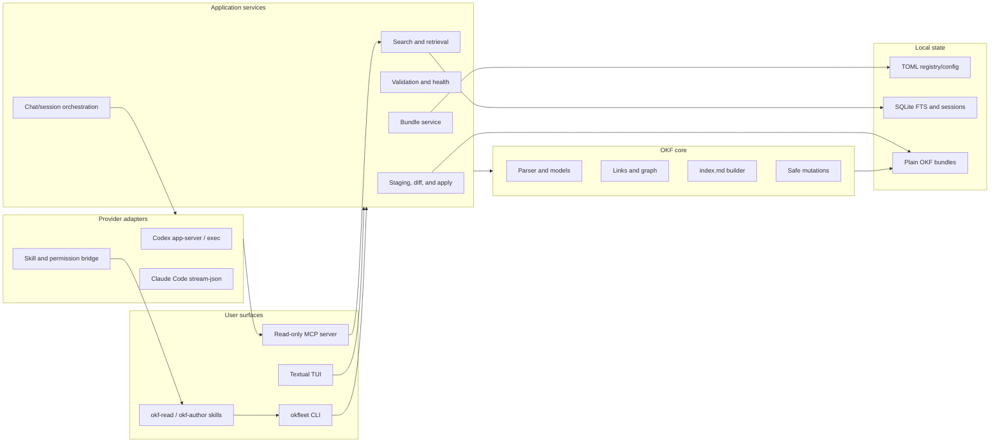

# OKFleet: repository evolution and development plan

> Status: proposed architecture and execution plan  
> Last updated: 2026-07-14  
> Working product name: **OKFleet**  
> Tagline: **The terminal workbench for a fleet of Open Knowledge Format bundles.**  
> Audience: maintainers, contributors, and coding agents working in this repository

## 1. Executive decision

Evolve this repository from a pair of agent skills into **OKFleet**, a local-first OKF toolkit with five equally supported surfaces:

1. A reusable Python library that is the single source of truth for parsing, validating, indexing, querying, and modifying OKF bundles.
2. A composable `okfleet` CLI suitable for shell workflows, CI, pre-commit, and agents.
3. A full-screen terminal UI for discovering, browsing, searching, validating, and graphing local and globally registered bundles.
4. An integrated chat workbench that can use either Codex or Claude Code with the user's existing authentication and OKF skills.
5. The existing Claude/Codex-compatible Agent Skills and plugin packaging, preserved as first-class distribution surfaces.

The key architectural rule is that the TUI, CLI, skills, MCP server, and provider adapters must call the same application services. Business logic must not live in TUI widgets, CLI callbacks, or duplicated skill scripts.

The default experience will be safe and local:

- Bundle content and the search index remain on the user's machine.
- OKFleet never stores provider credentials; it delegates authentication to installed Codex and Claude Code clients.
- Fleet-wide chat is structurally read-only: it receives only read tools and retrieved bundle context.
- Agent-assisted edits happen in a temporary staging workspace by default. The user reviews a diff, validation results, and conflicts before applying anything to the real bundle.
- Existing `okf.py validate`, `okf.py index`, and `okf.py list` behavior remains compatible while the package grows around it.

## 2. Product identity

### 2.1 Working name

**OKFleet** combines `OKF` with a fleet of local and shared knowledge bundles. It fits the central product model: a developer can inspect one bundle in a workbench or navigate and ask questions across a fleet.

Recommended naming:

- Product: `OKFleet`
- Python distribution: `okfleet`
- Python import package: `okfleet`
- Executable: `okfleet`
- Optional short executable alias after v1.0: `okf`
- Repository target name: `okfleet`
- Plugin display name: `OKFleet — OKF Toolkit`

This is a working name. Before publishing packages or renaming the GitHub repository, perform exact-name checks on GitHub, PyPI, crates.io, npm, relevant trademarks, and domains. A preliminary web search did not reveal an obvious developer tool using the exact `OKFleet` name, but that is not a legal or registry clearance.

### 2.2 Positioning

OKFleet is not an AI chat wrapper with an OKF prompt. It is an OKF-native developer workbench whose deterministic tools remain useful without any model installed. Agent chat is an optional, provider-pluggable layer on top of those tools.

Short description:

> Browse, validate, search, graph, and improve Open Knowledge Format bundles from one terminal workbench, with optional Codex and Claude Code collaboration.

## 3. Current repository baseline

The repository currently has a good, deliberately small seed:

- `skills/okf-author/` documents conformant authoring, cross-linking, index/log maintenance, and validation.
- `skills/okf-read/` documents progressive-disclosure bundle navigation and permissive consumption.
- Each skill contains a 253-line zero-dependency `scripts/okf.py` helper.
- The two helper files are currently byte-identical.
- The helper exposes `validate`, `index`, `list`, and `selftest` entry points.
- The validator enforces required frontmatter/type rules and reports quality warnings for descriptions, links, and log headings.
- The index generator groups concepts by type and preserves some curated directory descriptions.
- `.claude-plugin/` contains a Claude Code plugin and marketplace manifest.
- `evals/evals.json` plus `okf-skill-workspace/grade.py` evaluate skill behavior.
- There is no `pyproject.toml`, installable library, normal unit-test suite, registry, search database, TUI, MCP server, or provider abstraction.

The codebase graph confirms three Python entry points: the two duplicated helper scripts and the eval grader. There are no internal package boundaries to migrate, so the project can establish clean boundaries now without a long compatibility tail.

### 3.1 Compatibility commitments

Until a documented major version change:

- Keep both existing skill names: `okf-author` and `okf-read`.
- Keep the existing Claude plugin installation route working.
- Keep the standalone helper usable with only the Python standard library; PyYAML may remain optional.
- Preserve the commands, core output meaning, and exit-code semantics of `validate`, `index`, and `list`.
- Continue accepting unknown concept types and extra frontmatter keys.
- Do not require an OKFleet database or config file to consume a plain OKF directory.
- Do not rewrite curated `index.md` files without an explicit write/force choice.

## 4. Goals, non-goals, and success measures

### 4.1 Goals

- Make plain OKF directories pleasant to use by humans, shell scripts, editors, CI, and agents.
- Discover bundles near the current path and maintain an explicit global bundle registry.
- Provide fast metadata and full-text search across thousands of concepts.
- Make relationships visible through outbound links, backlinks, broken links, orphans, and graphs.
- Turn validation into actionable diagnostics with stable codes, file locations, severity, and suggested fixes.
- Support safe concept creation, move/rename, link repair, index regeneration, and log updates.
- Offer an excellent keyboard-first TUI that remains usable in narrow terminals and with screen readers.
- Provide provider-neutral chat sessions with normalized streamed events.
- Use the existing OKF skills reliably in both Codex and Claude Code sessions.
- Guarantee that fleet-wide chat cannot alter registered bundle sources through OKFleet.
- Preserve a fully useful non-AI workflow.

### 4.2 Explicit non-goals for v1.0

- Hosting or syncing bundles in a proprietary cloud.
- Replacing Git, GitHub, or an editor.
- Inventing a new OKF specification or a closed extension schema.
- Requiring embeddings, a vector database, an API key, or a paid provider.
- Executing arbitrary remote bundle code.
- Automatically committing, pushing, or opening pull requests.
- Providing multi-user collaboration or access control beyond local filesystem permissions.
- Guaranteeing semantic truth of concept bodies; validation checks format and quality signals, not factual correctness.
- Supporting every model vendor in v1.0. The abstraction should allow it, but only Codex and Claude Code are committed.

### 4.3 v1.0 success measures

| Area | Target |
|---|---|
| Compatibility | Existing three helper commands pass golden tests against current behavior and published sample bundles. |
| Safety | Fleet chat produces zero source-bundle writes in adversarial integration tests. |
| Search | Warm local FTS query over 10,000 concepts has p95 application latency below 150 ms on a typical developer laptop. |
| Incremental indexing | Unchanged files are skipped by content hash; a one-file update does not rebuild the entire fleet index. |
| TUI | Every core browse/search/validate/chat action is keyboard reachable and has a command-palette entry. |
| Provider parity | Both providers can start, stream, cancel, resume, cite concepts, and run a staged bundle work session. |
| Diagnostics | Every validation finding has a stable code, severity, path, and line when determinable. |
| Packaging | `uvx okfleet`, `pipx install okfleet`, the Claude plugin, and Codex-compatible skills have tested install paths. |
| CI | Unit, property, golden, provider-contract, and TUI smoke tests pass on macOS and Linux; Windows support is documented accurately. |

## 5. Users and primary workflows

### 5.1 Personas

- **Bundle reader:** needs to find a metric, API, table, or playbook quickly and follow its relationships.
- **Bundle author:** creates and maintains concepts while keeping links, indexes, timestamps, and logs correct.
- **Knowledge maintainer:** monitors stale, orphaned, duplicated, malformed, or weakly linked knowledge across many bundles.
- **Developer/analyst:** asks questions across several domain bundles and needs source-qualified answers.
- **Automation author:** wants stable commands and JSON output for CI, hooks, scripts, and agents.
- **Agent user:** wants to choose Codex or Claude Code without learning two unrelated session UIs.

### 5.2 Golden workflows

#### Open a nearby bundle

1. Run `okfleet` anywhere inside or above a repository.
2. OKFleet discovers confident bundle candidates under the configured scan boundary.
3. The sidebar separates `LOCAL` discoveries from the globally registered `FLEET`.
4. Select a bundle to see its health, concept tree, recent changes, and Git state.

#### Find and inspect a concept

1. Press `/` and search titles, descriptions, types, tags, IDs, and bodies.
2. Filter with expressions such as `type:Metric tag:finance bundle:warehouse`.
3. Open a result to render Markdown, frontmatter, outbound links, backlinks, and source path.
4. Jump through relationships without losing navigation history.

#### Improve one bundle with an agent

1. Open a bundle and press `c` for chat.
2. Choose Codex or Claude Code; OKFleet remembers a default but shows the active provider clearly.
3. Start in `Read` or `Work (staged)` mode.
4. OKFleet ensures the matching `okf-read` or `okf-author` skill is available and explicitly selected.
5. Stream text, tools, validation, and file changes into the chat activity view.
6. In work mode, review the staged diff and diagnostics, then apply or reject it.

#### Ask across bundles

1. Open Fleet Chat and select all bundles, a saved collection, or an explicit subset.
2. Ask a question.
3. The retrieval layer searches and expands relevant links, then exposes only read-only OKFleet tools/context.
4. The answer cites bundle-qualified concept IDs such as `warehouse:metrics/net_revenue`.
5. No write/apply controls exist in Fleet Chat.

#### Run in CI

1. Run `okfleet validate path --format sarif` or `--format json`.
2. Run `okfleet index path --check` to catch stale generated indexes.
3. Optionally run `okfleet health path --fail-on error` for broken links or quality policies.

## 6. Product scope and feature priorities

### 6.1 P0: required for the first useful public beta

- Canonical OKF parser and model.
- Backward-compatible validation, list, and index commands.
- Explicit bundle registration and safe local discovery.
- SQLite FTS5 indexing with incremental updates.
- CLI with text, JSON, and JSONL output where appropriate.
- TUI bundle tree, concept renderer, metadata, search, and diagnostics.
- Read-only bundle chat with Codex and Claude Code.
- Read-only fleet chat with qualified citations.
- Provider doctor/capability detection.
- Existing skill/plugin compatibility and install documentation.

### 6.2 P1: required before v1.0

- Staged agent work sessions, diff review, conflict detection, and apply.
- Create-concept wizard and safe move/rename with inbound-link updates.
- Backlink, orphan, broken-link, duplicate-ID, and staleness reports.
- Git-aware status and diff views.
- Read-only MCP server for OKF tools.
- Graph export to Mermaid, DOT, and JSON.
- Watch mode and background incremental indexing.
- Shell completions, pre-commit example, and CI examples.
- Session history and provider-native resume mapping.
- SARIF diagnostics for code-hosting integrations.

### 6.3 P2: advanced capabilities delivered in 0.5.0

The original post-v1 scope was implemented early so the repository can be exercised as one coherent toolkit. Each item below is present behind an explicit CLI flag, command, entry point, or read-only surface; future releases should harden these contracts rather than fork parallel implementations.

- [x] Optional local embeddings, disabled by default.
- [x] Saved searches and named bundle collections.
- [x] Pluggable importers for OpenAPI, dbt, SQL schemas, and data catalogs.
- [x] Bundle comparison and drift reports.
- [x] Extension/plugin API for custom diagnostics and concept templates.
- [x] Optional local web UI reusing the same application services.
- [x] Remote bundle sources with explicit clone/cache semantics.
- [x] Language Server Protocol support for editor diagnostics and navigation.
- [x] Team policy packs for required fields, allowed types, tags, and freshness targets.

## 7. TUI experience

### 7.1 Layout

The default wide layout uses three panes plus a status/footer area:

```text
┌─ OKFleet ────────────────────────────────────────────────────────────────┐
│ LOCAL / FLEET       │ Concept / Health / Graph     │ Chat / Inspector   │
│                     │                              │                    │
│ ▾ local repo        │ # Net Revenue                │ CODEX · READ        │
│   ▾ metrics         │                              │                    │
│     net_revenue     │ Rendered markdown...         │ You: How is this…   │
│   ▾ tables          │                              │ Agent: ...          │
│ ▾ global            │ Links · Backlinks · Source  │ tool activity...    │
│   warehouse         │                              │                    │
├─────────────────────┴──────────────────────────────┴────────────────────┤
│ / search  c chat  v validate  d diff  Ctrl+P commands  ? help          │
└─────────────────────────────────────────────────────────────────────────┘
```

Responsive behavior:

- At medium width, Inspector/Chat becomes a toggled drawer.
- At narrow width, screens become tabs rather than squeezed columns.
- Markdown source is always available when rich rendering is unsuitable.
- `NO_COLOR`, terminal theme detection, reduced motion, and screen-reader mode are respected.

### 7.2 Screens

| Screen | Purpose |
|---|---|
| Home | Recent bundles/sessions, provider health, discovery summary, and quick actions. |
| Fleet | Local discoveries, global registry, collections, and aggregate health. |
| Bundle | Concept tree, bundle metadata, Git state, health, and recent changes. |
| Concept | Rendered body, frontmatter, source, links, backlinks, and citations. |
| Search | Query input, filters, ranked results, snippets, and selected scope. |
| Health | Grouped diagnostics, stale/orphaned concepts, fixes, and export. |
| Graph | Focused neighborhood or bundle graph with list fallback and exports. |
| Chat | Provider-neutral transcript, tools/activity, citations, usage, and cancel/resume. |
| Diff | Staged changes, per-file hunks, diagnostics, conflicts, apply/reject. |
| Settings | Discovery, registry, providers, keymap, theme, privacy, and index controls. |

### 7.3 Default keybindings

| Key | Action |
|---|---|
| `Ctrl+P` | Open command palette. |
| `/` | Search current scope. |
| `g l` | Go to local bundles. |
| `g f` | Go to fleet/global bundles. |
| `Enter` | Open selected item. |
| `Backspace` | Navigate back. |
| `Tab` / `Shift+Tab` | Move between panes. |
| `c` | Open or focus chat. |
| `w` | Start staged work session from a bundle screen. |
| `v` | Validate current bundle/concept. |
| `d` | Show current or staged diff. |
| `r` | Refresh current scope. |
| `e` | Open source in `$EDITOR`. |
| `?` | Contextual help. |
| `q` | Quit or close the topmost modal. |

All keys must be configurable. Destructive or mutating actions must not be single unconfirmed keystrokes.

### 7.4 Useful deterministic developer tools

The TUI and CLI should expose these without requiring chat:

- Validate spec conformance and quality policies.
- Preview/regenerate directory indexes.
- Create a concept from a type-aware template.
- Rename/move a concept and update inbound Markdown links.
- Find broken links, backlinks, orphans, cycles, and unresolved resources.
- Find stale concepts by timestamp and configurable thresholds.
- Find duplicate titles/resources and inconsistent type spellings.
- Inspect frontmatter/body/source side by side.
- Search with field filters and scope selection.
- Generate a focused relationship graph.
- Compare working tree changes to `HEAD` when the bundle is in Git.
- Open a concept in `$EDITOR` and refresh on save.
- Export inventories, diagnostics, and graphs as JSON/JSONL/SARIF/Mermaid/DOT.
- Run watch mode for continuous validation/indexing.
- Scaffold pre-commit and CI snippets without silently editing repo configuration.

## 8. Technical architecture

### 8.1 Technology decisions

| Concern | Decision | Reason |
|---|---|---|
| Language | Python 3.11+ for OKFleet; keep generated skill helper compatible with Python 3.9+ | Reuses the current implementation, matches the requested skills, and supports fast iteration. `uv` can provision Python even when the system Python is older. |
| Package/build | `uv` + PEP 621 `pyproject.toml` + Hatchling | Reproducible development and standard wheel/sdist builds. |
| TUI | Textual, using Rich/Textual Markdown rendering | Mature async TUI widgets, testing support, responsive layouts, and good Python integration. |
| CLI | Typer with Rich output; application services remain framework-independent | Typed commands and completion without coupling the core to presentation. |
| YAML | `ruamel.yaml` for round-trip writes; a dependency-light read path for the standalone helper | Preserve unknown fields, ordering, quoting, and comments when editing. |
| Search | Built-in SQLite with FTS5 | Local, fast, portable, inspectable, and no service to run. |
| File watching | `watchfiles` behind an application-level event interface | Efficient incremental refresh with a polling fallback. |
| Config paths | `platformdirs`; TOML for user/project config | Correct cross-platform paths and human-editable config. |
| Agent transport | Async subprocess adapters with explicit argv and normalized events | Reuses provider-native authentication and avoids shell interpolation. |
| Cross-bundle tools | Local read-only MCP server plus deterministic retrieval | Works with both providers and makes the mutation boundary explicit. |
| Tests | pytest, pytest-asyncio, Hypothesis, Textual Pilot, golden fixtures | Covers parsers, streams, UI behavior, and backwards compatibility. |
| Quality | Ruff, mypy/pyright, coverage, pre-commit | Fast feedback and clear repository conventions. |

Do not introduce a Node or Rust application layer for v1.0. A single Python process is enough for the core, CLI, TUI, and provider orchestration. Revisit a native launcher only if measured startup/distribution problems justify it.

### 8.2 Component map



### 8.3 Layering rules

1. `okfleet.domain` contains immutable or carefully controlled models and no UI/provider imports.
2. `okfleet.okf` implements format mechanics and accepts paths/streams; it does not know about Textual or Typer.
3. `okfleet.application` coordinates registries, search, workspaces, and use cases through interfaces.
4. `okfleet.infrastructure` implements SQLite, filesystem, Git, subprocess, config, and watcher adapters.
5. `okfleet.agents` implements provider capabilities and normalized events, without importing TUI widgets.
6. `okfleet.cli` and `okfleet.tui` are thin presentation layers.
7. The skill helper is a generated standalone artifact from the canonical dependency-light OKF implementation, never hand-maintained twice.
8. The MCP server calls application services. It does not directly query private SQLite tables or parse files independently.

### 8.4 Core domain model

Initial models:

- `BundleRef`: stable OKFleet ID, alias, canonical path, source (`local`, `global`, `explicit`), discovery confidence, and availability.
- `Bundle`: root path, detected OKF version, config, concept inventory, indexes, log, and Git context.
- `ConceptId`: normalized POSIX-style path without `.md`, always relative to one bundle.
- `Concept`: ID, source path, ordered frontmatter, Markdown body, source span metadata, and content hash.
- `ConceptSummary`: title, description, type, tags, resource, timestamp, and search snippet fields.
- `ConceptLink`: source concept, target text/path, resolved target, link style, source line, and nearby relation text.
- `Diagnostic`: stable code, severity, message, bundle, concept/path, line/column, related locations, and optional fix ID.
- `IndexDocument`: directory, preserved root frontmatter, generated sections, custom sections, and provenance marker.
- `SearchQuery` / `SearchHit`: parsed filters, rank, matched fields, snippet, and bundle-qualified citation.
- `AgentSession`: OKFleet session ID, provider-native ID, provider, mode, bundle scope, staged workspace, status, and timestamps.
- `AgentEvent`: normalized tagged union for messages, tools, changes, permissions, usage, errors, and lifecycle.
- `ChangeSet`: base hashes, added/changed/deleted/renamed files, unified diffs, diagnostics, and conflict state.

All bundle paths must be normalized and checked against the canonical bundle root before reads or writes. Bundle-qualified IDs use `<bundle-alias>:<concept-id>` at presentation and chat boundaries; internal database keys use stable bundle UUID plus concept ID.

## 9. Bundle discovery and registry

### 9.1 Definitions

- **Explicit bundle:** a path passed on the command line or selected by the user.
- **Local bundle:** a confident candidate discovered relative to the current path or project configuration for this launch.
- **Global bundle:** a bundle explicitly registered in the user's OKFleet registry and available from any path.
- **Collection:** a named set of registered bundle IDs used for search/chat scope; post-P0 but schema-ready from the start.

### 9.2 Discovery algorithm

Discovery must be conservative and explainable:

1. Resolve explicit paths first.
2. Load `.okfleet.toml` from the current directory up to the project boundary; explicit `bundle_roots` win over heuristics.
3. Look for a bundle-root `index.md` with `okf_version` frontmatter.
4. Detect directories containing at least one non-reserved Markdown file with parseable frontmatter and a non-empty `type`.
5. Group nested candidates under the highest plausible root inside the scan boundary so normal OKF subdirectories are not shown as separate bundles.
6. Mark ambiguous candidates with a confidence/reason and ask for confirmation in the TUI instead of silently registering them.
7. Skip `.git`, hidden directories, virtual environments, dependency/build directories, and configured excludes.
8. Do not follow directory symlinks by default. An opt-in flag must still prevent cycles and root escape.
9. Bound recursion by configurable depth and file count. Surface truncation rather than hiding it.

Discovery never mutates or registers a path automatically. Registration is an explicit user action.

### 9.3 State locations

Use `platformdirs` equivalents:

- Config: `~/.config/okfleet/config.toml` on XDG systems.
- Data: `~/.local/share/okfleet/okfleet.db`.
- Cache: `~/.cache/okfleet/` for derived previews and provider schemas.
- State: platform-appropriate state directory for logs and ephemeral session metadata.
- Project config: `.okfleet.toml`, optional and safe to commit.

Do not write an index database or hidden OKFleet files inside a bundle unless the user explicitly scaffolds project config.

Example user config:

```toml
version = 1

[ui]
theme = "system"
provider = "codex"

[discovery]
max_depth = 5
follow_symlinks = false
exclude = [".git", ".venv", "node_modules", "dist", "build"]

[chat]
default_bundle_mode = "read"
default_work_strategy = "staged"

[[bundles]]
id = "018f..."
alias = "warehouse"
path = "/Users/me/knowledge/warehouse"

[[bundles]]
id = "0190..."
alias = "platform"
path = "/Users/me/work/platform/docs/okf"
```

Registry writes must use file locking, schema versioning, atomic replacement, and human-readable errors. Migrations must be tested from every previously released config version.

## 10. Parsing, validation, indexing, and mutation

### 10.1 Parsing contract

- Preserve all unknown frontmatter fields.
- Preserve field order, scalar style, comments, and body bytes where a field-specific edit permits it.
- Treat `index.md` and `log.md` as reserved at every level.
- Keep root-relative OKF links distinct from filesystem-absolute paths.
- Normalize concept IDs to forward slashes on every OS.
- Decode UTF-8 strictly by default and report a diagnostic rather than silently replacing bytes.
- Represent malformed concepts so the health view can show them; do not drop them from inventories.
- Never reject an entire bundle because one document is malformed.

### 10.2 Diagnostic tiers

Separate specification conformance from quality policy:

- `ERROR`: hard OKF conformance or safe-processing failure.
- `WARNING`: likely maintenance problem such as a broken link or missing description.
- `INFO`: improvement opportunity such as inconsistent type casing or stale timestamp.

Initial stable codes should include:

| Code | Severity | Meaning |
|---|---|---|
| `OKF001` | Error | Missing frontmatter on a concept. |
| `OKF002` | Error | Unparseable YAML frontmatter. |
| `OKF003` | Error | Missing or empty required `type`. |
| `OKF004` | Error | Frontmatter in a non-root `index.md`. |
| `OKF101` | Warning | Missing or empty `description`. |
| `OKF102` | Warning | Broken internal Markdown link. |
| `OKF103` | Warning | Malformed `log.md` date heading. |
| `OKF104` | Warning | Duplicate concept ID after case normalization on a case-insensitive target. |
| `OKF201` | Info | Concept is older than configured freshness policy. |
| `OKF202` | Info | Concept has no inbound or outbound concept links. |
| `OKF203` | Info | Similar type strings may be accidental variants. |

The first four and the current warnings must remain behaviorally compatible with the existing helper. New checks can be enabled in the rich `health` command without making the standalone `validate` unexpectedly stricter.

### 10.3 Index generation

- Preview is the default; `--write` is explicit.
- Preserve allowed root `okf_version` frontmatter.
- Preserve curated directory descriptions and clearly marked custom sections.
- Refuse to overwrite an index that cannot be safely round-tripped unless `--force` is passed.
- Support `--check` for CI and deterministic byte output.
- Update only affected directory indexes after a mutation.
- Add an optional generated marker for new bundles, but do not inject it into existing indexes without consent.

### 10.4 Safe mutations

Every mutation is a planned `ChangeSet` before it touches source files:

- Create concept.
- Update frontmatter/body.
- Move/rename concept.
- Repair one or all inbound links after move.
- Regenerate affected indexes.
- Add a newest-first `log.md` entry.
- Update timestamps.

Mutations must use optimistic concurrency through content hashes. If a file changed since the plan was made, the apply step reports a conflict and does not overwrite it. Multi-file changes use temporary files and best-effort transactional rollback. The staging workbench remains the preferred path for large agent changes.

## 11. Search, retrieval, and knowledge graph

### 11.1 SQLite schema

The exact DDL can evolve behind repository interfaces, but the logical tables are:

- `bundles`: stable ID, alias, path, version, availability, last scan, and config hash.
- `concepts`: bundle ID, concept ID, path, metadata fields, body, content hash, mtime, and parse status.
- `concepts_fts`: FTS5 virtual table over ID, title, description, type, tags, and body.
- `links`: source key, raw target, resolved target key, line, relation context, and status.
- `diagnostics`: current computed findings by bundle/content version.
- `sessions`: OKFleet/provider session mapping and mode metadata; no provider credentials.
- `collections`: named bundle selections.
- `schema_migrations`: local database version.

SQLite must use WAL mode when safe, transactions for index updates, and foreign-key checks. The database is disposable derived state except for registry/session metadata; provide `okfleet cache rebuild` and never make bundles depend on it.

### 11.2 Ranking and retrieval

P0 retrieval is deterministic and inspectable:

1. Parse field filters and scope.
2. Use FTS5 BM25 with boosts for exact concept ID, title, description, tags, then body.
3. Add exact resource/type matches.
4. Expand one hop through resolved links and backlinks with a lower score.
5. Deduplicate and fit results to a configurable token/character budget.
6. Include source-qualified IDs and short snippets in the model context.

No embeddings are required for v1.0. If later added, they must be opt-in per registry/collection, locally cacheable, provider-independent at the interface, and accompanied by a clear data egress notice.

### 11.3 Graph behavior

- Directory hierarchy and Markdown links are separate edge types.
- Link text/context is retained so a user or agent can infer relationship semantics.
- Graph views default to a selected concept plus one-hop neighbors; rendering an entire large bundle is an explicit action.
- Provide list/table fallback for terminals that cannot render a useful graph.
- Export focused/full graphs as Mermaid, DOT, and JSON.
- Never infer and persist semantic edges from model output without explicit user review.

## 12. Agent integration

### 12.1 Provider-neutral contract

```python
class AgentProvider(Protocol):
    async def probe(self) -> ProviderStatus: ...
    async def start(self, spec: SessionSpec) -> AgentSession: ...
    async def send(self, session: AgentSession, message: str) -> AsyncIterator[AgentEvent]: ...
    async def cancel(self, session: AgentSession) -> None: ...
    async def resume(self, native_session_id: str, spec: SessionSpec) -> AgentSession: ...
    async def close(self, session: AgentSession) -> None: ...
```

Normalized events:

- `session.started`
- `message.delta` and `message.completed`
- `reasoning.delta` when the provider exposes displayable reasoning summaries
- `tool.started`, `tool.updated`, and `tool.completed`
- `file.changed`
- `permission.requested` and `permission.resolved`
- `diagnostic`
- `usage`
- `turn.completed`, `turn.failed`, and `session.closed`

Provider-specific payloads may be retained under a namespaced debug field, but UI logic must depend only on normalized fields.

### 12.2 Codex adapter

Primary rich-client transport: `codex app-server` over stdio JSONL. The current official Codex manual describes app-server as the deep integration surface for authentication, history, approvals, and streamed events, using a JSON-RPC-style protocol with threads, turns, and items. It also supports generating version-matched schemas. The command is currently marked experimental, so OKFleet must capability-probe it and isolate protocol changes behind the adapter.

Fallback transport: stable `codex exec --json`, capturing the `thread.started` ID and continuing with `codex exec resume <id>`. The fallback supports streaming events and read-only/workspace-write sandbox selection, but live approval UX is limited; unsupported approval requests fail closed and the TUI explains the limitation.

Implementation requirements:

- Reuse the user's saved Codex login; never read or copy auth files.
- Spawn with an argv list, not a shell string.
- Set `cwd` and explicit sandbox/approval policy for every session.
- Generate/cache app-server schemas by detected Codex version for contract tests.
- Map threads/turns/items into normalized session/events.
- Support interrupt, resume, and clean child-process shutdown.
- Do not hard-code a model; use provider/user defaults unless explicitly configured.

Official source notes:

- [Codex app-server implementation](https://github.com/openai/codex/tree/main/codex-rs/app-server)
- [Codex documentation](https://developers.openai.com/codex/)

### 12.3 Claude Code adapter

Use the installed Claude Code CLI in print/stream mode so the user's Claude Code authentication and plugin support remain available:

- `claude -p`
- `--output-format stream-json`
- `--input-format stream-json` where a persistent streaming subprocess is supported reliably
- `--include-partial-messages` for responsive deltas
- `--resume <session-id>` for fallback multi-turn continuation
- `--plugin-dir <okfleet-plugin-root>` to guarantee bundled OKF skills for the session
- `--tools` and permission flags derived from the session mode
- `--permission-prompt-tool` with the OKFleet permission MCP bridge for staged work

The adapter must parse system/init/result records, capture `session_id`, normalize content/tool events, support cancellation, and reject unknown protocol records safely.

Official source notes:

- [Claude Code CLI reference](https://code.claude.com/docs/en/cli-usage)
- [Claude Code plugins](https://code.claude.com/docs/en/plugins)
- [Claude Code Agent SDK](https://platform.claude.com/docs/en/agent-sdk/overview)

The direct CLI adapter is the v1 default. An Agent SDK implementation can be added behind the same interface later if it preserves user authentication, skills, and permission behavior.

### 12.4 Capability matrix

`okfleet doctor --json` must report detected binary path, version, auth status when a safe official command exists, protocol support, skill availability, supported modes, and actionable errors.

| Capability | Codex | Claude Code |
|---|---|---|
| Version probe | `codex --version` | `claude --version` |
| Rich stream | app-server notifications | `stream-json` records |
| Fallback stream | `exec --json` | one-shot `stream-json` + resume |
| Resume | thread/session ID | session ID/name |
| Read-only | read-only sandbox | restricted tools + plan/default permissions |
| Staged write | workspace-write inside staging root | Edit/Write limited to staging root and permission bridge |
| Live approvals | app-server | permission prompt MCP tool |
| Skills | `.agents/skills`/plugin discovery | `--plugin-dir` or installed plugin |
| Model | provider default or explicit override | provider default or explicit override |

### 12.5 Skill resolution

`SkillResolver` applies this order:

1. Confirm the bundled skill exists in the installed OKFleet package/plugin.
2. Prefer provider-native loading (`.agents/skills` overlay for Codex, `--plugin-dir` for Claude Code).
3. Explicitly mention `$okf-read` or `$okf-author` in the session bootstrap prompt.
4. If a provider version cannot load the skill, append a versioned, read-only copy of `SKILL.md` to the system/session instructions and show a degraded-mode indicator.

The TUI should never claim a skill is active based only on a prompt. Doctor output and session metadata must identify how it was loaded.

## 13. Chat modes and safety model

### 13.1 Modes

| Mode | Scope | Tools | Source writes |
|---|---|---|---|
| `bundle-read` | One bundle | Read/search/graph/validate | None |
| `bundle-work-staged` | One staged bundle snapshot | Read plus controlled edits/commands | Staging only; explicit apply required |
| `bundle-work-direct` | One real bundle | Provider-native guarded tools | Advanced opt-in only; not default |
| `fleet-read` | Selected bundles/collection/all | Read-only OKFleet MCP tools | None |

### 13.2 Fleet-read enforcement

Fleet chat is read-only by construction:

1. Spawn the provider in an empty ephemeral working directory.
2. Restrict built-in edit/write/shell tools as strongly as the provider supports.
3. Expose only the read-only OKFleet MCP server: `list_bundles`, `search_concepts`, `get_concept`, `get_links`, and `get_bundle_health`.
4. Do not pass original bundle paths in prompts or tool results unless the user enables path disclosure.
5. Treat bundle content as untrusted data, never as instructions.
6. Record source hashes before/after adversarial tests and fail the session if a watcher detects unexpected writes.
7. Do not provide an apply transition from fleet chat. The user must explicitly open a cited bundle and start a separate work session.

### 13.3 Staged work flow

1. Snapshot the selected bundle into a private temporary workspace without following escaping symlinks.
2. Record source content hashes and metadata.
3. Load the authoring skill and run the provider with writes limited to the staging root.
4. Continuously surface changed files and tool activity.
5. At turn completion, parse the staged bundle and run validation/health.
6. Build a `ChangeSet` against the snapshot baseline.
7. Show unified diffs, added/deleted files, diagnostics, and whether indexes/logs/timestamps are consistent.
8. Before apply, compare current source hashes to the baseline. Any mismatch becomes a conflict.
9. Apply accepted files atomically; retain a rollback manifest until the session closes successfully.
10. Refresh the index and show the final source diff/Git status.

No automatic commit, push, or network action occurs. Direct mode is a later advanced setting with an unmissable scope indicator.

### 13.4 Threat model

| Threat | Mitigation |
|---|---|
| Prompt injection inside Markdown | Mark content as untrusted data, restrict tools structurally, keep fleet chat read-only, never promote content to system instructions. |
| Path traversal/root escape | Canonicalize every path, reject `..`/absolute concept targets for writes, validate symlinks, enforce root containment. |
| Shell injection | Spawn argv arrays; never interpolate prompts/paths into `shell=True` commands. |
| Unexpected provider writes | Staged workspaces, provider sandbox/tool restrictions, file watcher, source hash checks. |
| Secret leakage | No credential reads, no prompt logging by default, optional path redaction, warn before sending selected content to a provider. |
| Malicious/huge bundles | File/depth/size limits, streaming reads, timeouts, cancellation, diagnostic rather than crash. |
| Stale apply overwrites | Optimistic content hashes and per-file conflict handling. |
| Database corruption | Transactions, migrations, backup before migration, rebuildable derived index. |
| Provider protocol drift | Version probe, capability flags, generated/fixture schemas, graceful degradation. |
| Skill drift | One canonical skill source, package version metadata, contract evals for both providers. |

## 14. CLI and MCP surface

### 14.1 CLI commands

The executable with no subcommand opens the TUI. Core commands:

```text
okfleet [PATH]
okfleet tui [PATH]
okfleet doctor [--format text|json]

okfleet discover [PATH] [--depth N] [--format text|json]
okfleet bundles list|add|remove|rename|refresh
okfleet collections list|create|add|remove|delete

okfleet list BUNDLE [--type TYPE] [--tag TAG] [--format text|json|jsonl]
okfleet show BUNDLE:CONCEPT [--source]
okfleet search QUERY [--bundle ALIAS] [--collection NAME] [--format ...]
okfleet links BUNDLE:CONCEPT [--inbound|--outbound|--broken]
okfleet graph SCOPE [--depth N] [--format mermaid|dot|json]

okfleet validate BUNDLE [--format text|json|sarif]
okfleet health BUNDLE [--stale-after DAYS] [--format ...]
okfleet index BUNDLE [--write|--check] [--force]
okfleet watch BUNDLE

okfleet new BUNDLE CONCEPT_ID --type TYPE [--title TITLE]
okfleet move BUNDLE:OLD_ID NEW_ID [--update-links] [--dry-run]
okfleet apply CHANGESET_ID

okfleet chat [SCOPE] [--provider codex|claude] [--mode read|work]
okfleet sessions list|resume|delete

okfleet mcp serve [--scope ...] [--transport stdio]
okfleet cache status|rebuild|clear
okfleet completion bash|zsh|fish|powershell
```

Rules:

- Mutating commands support `--dry-run` when meaningful.
- Machine formats write only data to stdout; progress/errors go to stderr.
- Stable exit codes distinguish success, diagnostics found, invalid invocation, unavailable provider, and internal error.
- JSON records carry a `schema_version`.
- Paths and bundle aliases are accepted consistently across commands.

### 14.2 Read-only MCP tools

MCP server v1 tools:

- `okfleet_list_bundles(scope?, collection?)`
- `okfleet_search_concepts(query, bundles?, limit?, include_body?)`
- `okfleet_get_concept(bundle, concept_id, include_source?)`
- `okfleet_get_links(bundle, concept_id, direction?, depth?)`
- `okfleet_get_bundle_health(bundle, severities?, limit?)`
- `okfleet_get_index(bundle, directory?)`

Every tool is annotated read-only where the SDK supports annotations. Results contain bundle-qualified citations and never expose database implementation details. Mutating MCP tools are deliberately excluded from v1; staged work uses provider filesystem edits inside the snapshot.

## 15. Proposed repository layout

```text
okfleet/
├── .claude-plugin/
│   ├── plugin.json
│   └── marketplace.json
├── .codex-plugin/
│   └── plugin.json
├── docs/
│   ├── OKFLEET_DEVELOPMENT_PLAN.md
│   ├── architecture/
│   ├── user-guide/
│   └── provider-protocols/
├── examples/
│   ├── demo-bundle/
│   └── config/
├── src/okfleet/
│   ├── __init__.py
│   ├── domain/
│   ├── okf/
│   ├── application/
│   ├── infrastructure/
│   ├── search/
│   ├── agents/
│   ├── mcp/
│   ├── cli/
│   └── tui/
├── skills/
│   ├── okf-author/
│   └── okf-read/
├── tools/
│   ├── build_standalone_helper.py
│   └── verify_generated.py
├── tests/
│   ├── unit/
│   ├── property/
│   ├── golden/
│   ├── contract/
│   ├── integration/
│   └── tui/
├── evals/
├── pyproject.toml
├── uv.lock
├── AGENTS.md
├── CHANGELOG.md
├── CONTRIBUTING.md
├── LICENSE
└── README.md
```

The final implementation may use fewer physical subpackages initially, but the dependency directions above must remain visible and enforceable.

## 16. Delivery phases and definitions of done

Phases are dependency gates, not calendar estimates. Work within a phase can run in parallel when file ownership is clear.

### Phase 0: foundation and contracts

Deliverables:

- Accept this plan and record major decisions as short ADRs.
- Add `pyproject.toml`, `src/`, `tests/`, lint/type/test configuration, and CI.
- Capture golden behavior for the current standalone helper against representative bundles.
- Define domain models, diagnostic codes, JSON schemas, provider events, and exit codes.
- Add a small demo bundle with valid, malformed, linked, broken, stale, and curated-index cases.

Done when:

- `uv sync`, lint, type check, and an empty/smoke test suite run locally and in CI.
- Existing helper behavior is frozen in golden fixtures before refactoring.
- No plugin install path is broken.

### Phase 1: canonical OKF core

Deliverables:

- Parser, inventory, validator, health diagnostics, links/backlinks, index builder, and safe mutation planner.
- Generated standalone helper and parity check for both skill copies.
- Unit/property/golden tests against public sample bundles and edge fixtures.

Done when:

- Existing helper commands are generated from one canonical source and pass parity tests.
- Unknown fields/types survive round-trip edits.
- Malformed files become diagnostics rather than crashes.
- Move/rename produces correct dry-run link/index/log changes.

### Phase 2: registry, search, CLI, and MCP

Deliverables:

- Local discovery, global registry, project/user config, SQLite schema/migrations, FTS, incremental indexing, graph exports.
- Full deterministic CLI and read-only MCP tools.
- JSON/JSONL/SARIF schemas and completion.

Done when:

- A user can discover/register two bundles, search them, inspect links, validate, and export diagnostics without a TUI or provider.
- Reindexing unchanged content performs no concept writes.
- MCP contract tests prove every exposed operation is read-only.

### Phase 3: TUI explorer

Deliverables:

- Responsive application shell, command palette, navigation/history, Fleet/Bundle/Concept/Search/Health/Graph screens, editor handoff, settings.
- Watcher-driven refresh and useful empty/error/loading states.

Done when:

- Textual Pilot tests cover golden workflows at wide and narrow sizes.
- A keyboard-only user can execute all deterministic P0 actions.
- Provider absence does not reduce non-chat functionality.

### Phase 4: read-only chat

Deliverables:

- Provider interface/event stream, doctor, Codex app-server plus exec fallback, Claude stream-json adapter, skill resolver, session mapping.
- Bundle-read and fleet-read chat, citations, cancel/resume, tool/activity views.

Done when:

- Recorded contract fixtures cover successful, failed, cancelled, partial, unknown, and resumed provider streams.
- Optional authenticated smoke tests pass for both providers.
- Adversarial fleet chat tests produce no source changes.
- Every cross-bundle answer prompt requires bundle-qualified citations.

### Phase 5: staged workbench

Deliverables:

- Snapshot workspace, author skill activation, permission bridge, change watcher, validation, diff UI, optimistic conflict detection, atomic apply/rollback.
- Create/move authoring flows and Git-aware source status.

Done when:

- Both providers can create or improve a concept in staging.
- Invalid output is reviewable but not auto-applied.
- A concurrent source edit reliably blocks conflicting apply.
- Apply refreshes indexes/health and never commits automatically.

### Phase 6: release hardening

Deliverables:

- Claude and Codex plugin manifests, package builds, install docs, changelog, contribution guide, security/privacy docs, CI/pre-commit examples.
- macOS/Linux matrix, Windows/WSL documentation and smoke coverage.
- Performance benchmark and large-bundle fixes.

Done when:

- Wheel/sdist and plugin validation pass from clean environments.
- `uvx okfleet`, `pipx install okfleet`, Claude plugin loading, and Codex skill/plugin loading are documented and tested.
- v1.0 success measures are met or exceptions are documented explicitly.

## 17. Agent-ready work packages

Each package should become one issue/branch-sized change where possible. The `Depends on` column is a hard dependency; packages with satisfied dependencies can run concurrently.

| ID | Work package | Primary files/area | Depends on | Acceptance |
|---|---|---|---|---|
| `FND-01` | Package and quality scaffold | `pyproject.toml`, `src/`, CI | — | Install, lint, type, test commands work. |
| `FND-02` | Demo/edge fixture bundles | `examples/`, `tests/fixtures/` | — | Covers valid and failure cases without generated ambiguity. |
| `FND-03` | Public schemas and exit codes | `domain`, `schemas/` | `FND-01` | Versioned JSON/event/diagnostic contracts tested. |
| `CORE-01` | Parser and ordered frontmatter model | `okf/parser.py`, models | `FND-01` | Round trips unknown metadata and reports malformed inputs. |
| `CORE-02` | Validator and diagnostic codes | `okf/validation.py` | `CORE-01`, `FND-02` | Current checks preserved; stable locations/codes. |
| `CORE-03` | Links and graph | `okf/links.py`, `okf/graph.py` | `CORE-01` | Root/relative links, backlinks, broken links, exports tested. |
| `CORE-04` | Index builder | `okf/indexes.py` | `CORE-01` | Deterministic preview/write/check and curated-index safety. |
| `CORE-05` | Mutation planner | `okf/mutations.py` | `CORE-02..04` | Create/move/link repair plans and conflict-safe apply. |
| `COMPAT-01` | Standalone helper generation | `tools/`, skill scripts | `CORE-01..04` | Generated copies equal; legacy golden suite passes. |
| `REG-01` | Bundle discovery | `application/discovery.py` | `CORE-01` | Confidence/exclusion/symlink/truncation cases tested. |
| `REG-02` | Registry and config | `infrastructure/config.py` | `FND-03` | Atomic versioned user/project config with migrations. |
| `SEARCH-01` | SQLite repository/migrations | `search/database.py` | `CORE-01`, `REG-02` | Rebuildable WAL database and incremental hashes. |
| `SEARCH-02` | Query parser/ranking/retrieval | `search/` | `SEARCH-01`, `CORE-03` | Field filters, BM25, link expansion, citations. |
| `CLI-01` | Read commands | `cli/` | `REG-01..02`, `SEARCH-02`, `CORE-02..04` | Discover/list/show/search/validate/health/index/graph. |
| `CLI-02` | Mutation/session/cache commands | `cli/` | `CORE-05`, `AGENT-01` | Dry-run and machine-output rules pass. |
| `MCP-01` | Read-only MCP server | `mcp/` | `SEARCH-02`, `CORE-02..03` | Six tools, scope limits, annotations, contract tests. |
| `TUI-01` | Shell/navigation/theme | `tui/app.py`, widgets | `FND-01` | Responsive shell and command palette Pilot tests. |
| `TUI-02` | Fleet/Bundle/Concept screens | `tui/screens/` | `REG-01..02`, `CORE-01..04`, `TUI-01` | Browse and relationship golden flow works. |
| `TUI-03` | Search/Health/Graph screens | `tui/screens/` | `SEARCH-02`, `CORE-02..03`, `TUI-01` | Filters, diagnostics navigation, exports. |
| `AGENT-01` | Provider protocol/events/sessions | `agents/base.py`, domain | `FND-03` | Fake provider and normalized lifecycle suite. |
| `AGENT-02` | Codex adapter | `agents/codex.py` | `AGENT-01` | app-server and exec fixture streams, probe/resume/cancel. |
| `AGENT-03` | Claude adapter | `agents/claude.py` | `AGENT-01` | stream-json fixture streams, probe/resume/cancel. |
| `AGENT-04` | Skill resolver/bootstrap | `agents/skills.py` | `AGENT-01`, `COMPAT-01` | Native and degraded loading paths visible/tested. |
| `CHAT-01` | Bundle-read orchestration | `application/chat.py` | `AGENT-02..04`, `SEARCH-02` | Provider parity and source citations. |
| `CHAT-02` | Fleet-read orchestration | `application/chat.py` | `CHAT-01`, `MCP-01` | Selected scope only, no source writes. |
| `WORK-01` | Snapshot/diff/conflict engine | `application/workspace.py` | `CORE-05` | Safe symlinks, hashes, unified diff, rollback tests. |
| `WORK-02` | Permission bridge and staged chat | `agents/permissions.py`, chat | `WORK-01`, `AGENT-02..04` | Provider writes confined to staging; approvals normalized. |
| `TUI-04` | Chat/activity/diff screens | `tui/` | `CHAT-01..02`, `WORK-02` | Stream/cancel/resume/review/apply flows via fake provider. |
| `REL-01` | Codex plugin package | `.codex-plugin/`, skills | `COMPAT-01`, `MCP-01` | Plugin validator passes; no nonexistent components. |
| `REL-02` | Claude plugin update | `.claude-plugin/`, skills | `COMPAT-01` | Claude loads both skills and toolkit metadata. |
| `REL-03` | Python release/install docs | package/docs | all P0/P1 | Clean install and build matrix passes. |
| `PERF-01` | Large-fleet benchmark | `benchmarks/` | `SEARCH-02`, TUI | Targets measured; regressions recorded. |

### 17.1 Work package handoff template

Every agent/contributor handoff should include:

```markdown
## Objective
One observable outcome.

## Owned files
Files/directories this change may modify.

## Inputs and contracts
Models/interfaces/schemas that must be honored.

## Deliverables
Code, tests, fixtures, and docs.

## Non-goals
Adjacent work deliberately excluded.

## Verification
Exact commands and expected high-level results.

## Risks/decisions
Anything the next package must know.
```

Agents should not edit shared domain contracts casually. If a contract change is necessary, update its schema/tests and notify every dependent work package in the handoff.

## 18. Parallelization and merge strategy

After `FND-01` and `FND-03`, use four workstreams:

- **Core/data:** parser, diagnostics, links, index, mutations, discovery, search.
- **Surfaces:** CLI and TUI shell/screens against fakes/interfaces.
- **Agents:** normalized protocol, provider adapters, skills, MCP, chat, staging.
- **Release/quality:** fixtures, compatibility generator, docs, plugin manifests, CI, benchmarks.

Rules for low-conflict parallel work:

- Assign one owner to domain models and schemas.
- UI work uses fake application services until core implementations land.
- Provider work uses recorded/synthetic protocol fixtures; live calls are optional verification only.
- Do not let multiple agents hand-edit the generated skill helper.
- Keep migrations append-only and give each migration a unique sequential ID.
- Rebase or merge at completed vertical slices, not after every file.
- Every merge leaves `main` installable and deterministic commands usable.

## 19. Test and verification strategy

### 19.1 Test layers

- **Unit:** models, parsing, frontmatter, links, diagnostics, query parsing, config, event normalization.
- **Property:** arbitrary safe concept IDs/frontmatter/link paths; parse/render invariants; mutation containment.
- **Golden:** legacy helper output, generated indexes, JSON/SARIF, graph exports, TUI snapshots where stable.
- **Contract:** Codex app-server/exec JSONL, Claude stream-json, MCP schemas, CLI JSON schemas.
- **Integration:** temporary bundles/registries/databases, watcher updates, staged apply/conflicts, Git status.
- **TUI:** Textual Pilot at several terminal sizes, keyboard flows, async cancellation, no-provider behavior.
- **Security:** path escape, symlink, prompt injection fixtures, shell metacharacters, oversized files, fleet write detection.
- **Optional live:** authenticated Codex/Claude smoke tests marked and excluded from ordinary CI.
- **Performance:** generated 1k/10k/50k concept fleets, cold/warm search, incremental update, TUI load.

### 19.2 Required verification commands

The final repository should converge on:

```bash
uv sync --all-extras --dev
uv run ruff check .
uv run ruff format --check .
uv run mypy src
uv run pytest
uv run python tools/verify_generated.py
uv build
uvx --from dist/okfleet-*.whl okfleet doctor
```

Provider live tests require explicit environment opt-in and must never print tokens.

### 19.3 CI matrix

- Python 3.11, 3.12, and 3.13.
- Ubuntu latest and macOS latest for every merge.
- Windows latest for core/CLI; document whether the TUI/provider workbench is native or WSL-supported at each release.
- Minimum supported Codex/Claude versions plus current versions in scheduled compatibility jobs when installable.

## 20. Versioning, migration, and release path

Suggested milestones:

- `0.2.0`: canonical library and compatible CLI (`validate`, `index`, `list`).
- `0.3.0`: registry, search, health, graph, and explorer TUI.
- `0.4.0`: read-only Codex/Claude bundle and fleet chat.
- `0.5.0`: staged authoring workbench and safe apply.
- `0.8.0`: MCP, CI/SARIF, cross-platform hardening, performance.
- `1.0.0`: stable contracts and all P0/P1 definitions of done.

Repository rename sequence:

1. Ship at least one release from `okf-plugin` that announces OKFleet and keeps old install instructions working.
2. Publish `okfleet` distribution and executable.
3. Add Codex plugin manifest while retaining the Claude manifest.
4. Rename the GitHub repository only after package/plugin links use redirect-safe URLs.
5. Keep a compatibility note for `okf-plugin` search/install terms through 1.x.

## 21. Documentation set

Before v1.0, publish:

- Quickstart for TUI and CLI.
- Bundle discovery and global registry guide.
- Search syntax reference.
- Validation/diagnostic code reference.
- Codex setup, Claude Code setup, and provider doctor guide.
- Read-only fleet chat privacy model.
- Staged work, diff, conflicts, and rollback guide.
- Skills/plugin install and development guide.
- MCP tool reference.
- CI/pre-commit examples.
- Architecture and extension guide.
- Troubleshooting for terminal, provider auth, protocol versions, and corrupted cache.
- Security policy, privacy/data-flow statement, changelog, and contribution guide.

## 22. Decisions to revisit, not blockers

- Whether `okf` becomes a short executable alias after checking namespace conflicts.
- Whether Windows native staged-provider sandboxing can meet the same guarantees as macOS/Linux or should remain WSL-only initially.
- Whether direct write mode belongs in v1.x at all; staged work may be sufficient and safer.
- Which built-in importer contract should stabilize first for third-party compatibility; usage evidence should decide between OpenAPI and dbt.
- Whether embedding search provides enough measured benefit to justify privacy/cost complexity.
- Whether the read-only MCP server should later be distributed independently from the TUI package.

## 23. First implementation slice

The first merged vertical slice should be deliberately small but real:

1. Add package/test scaffolding.
2. Extract the parser, validator, list, and index behavior into the canonical library.
3. Generate both standalone helpers and prove parity.
4. Expose `okfleet list`, `okfleet validate`, and `okfleet index`.
5. Add a minimal TUI that discovers/opens one explicit bundle and renders its inventory/concepts/diagnostics.
6. Add fake-provider chat in the UI to lock the provider event contract before integrating real CLIs.

That slice establishes every architectural boundary while preserving the working plugin. Subsequent packages can then proceed in parallel without rebuilding foundations.
